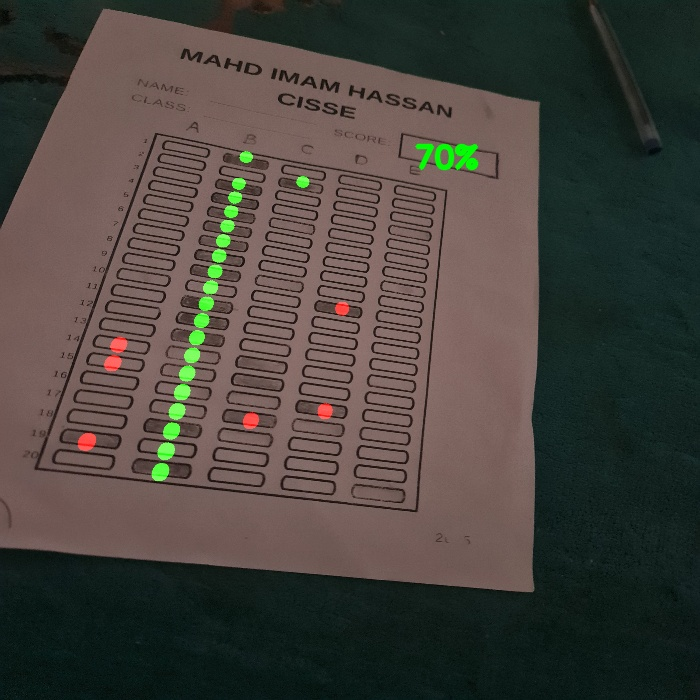

# OpenCV OMR Answer Sheet Scanner

A Python application using OpenCV to automatically scan and grade Optical Mark Recognition (OMR) answer sheets. It can process sheets from either a webcam feed or a static image file.

  ## Features

* Scans multiple-choice OMR answer sheets.
* Processes input from a live webcam feed or a pre-existing image file.
* Automatically detects the answer area and an optional score box.
* Uses image processing techniques (Grayscale, Blur, Canny Edge Detection, Contours) to isolate the answer grid.
* Performs Perspective Transform to get a top-down view of the answer grid.
* Detects marked bubbles based on pixel intensity within each answer slot.
* Compares detected answers against a predefined answer key.
* Calculates and displays the final score percentage.
* Overlays visual feedback on the processed image:
    * Highlights detected bubbles (Green for correct, Red for incorrect).
    * Indicates the correct answer bubble if the user's choice was wrong.
    * Draws the calculated score within the detected score box on the original image perspective.
* Provides a stacked view of intermediate processing steps for debugging.
* Allows saving the final graded image with annotations.
* Configurable number of questions and choices per question.

## Requirements

* Python 3.x
* OpenCV (`opencv-python`)
* NumPy

## Installation

1.  **Clone the repository (or download the files):**
    ```bash
    git clone <your-repository-url>
    cd <your-repository-name>
    ```
2.  **Install the required Python libraries:**
    ```bash
    pip install opencv-python numpy
    ```

## File Structure

* `main.py`: The main script to run the OMR scanning and grading process. Contains the main loop, image processing pipeline, and grading logic.
* `utils.py`: A utility module containing helper functions used in `main.py` for tasks like stacking images, finding/reordering contours, splitting the grid into boxes, and drawing results.
* `Scanned/` (Optional/Created on save): Directory where graded images are saved when the 's' key is pressed.

## Configuration

Before running, you might need to adjust some settings in `main.py`:

* `webCamFeed`: Set to `True` to use the webcam, `False` to use an image file.
* `pathImage`: If `webCamFeed` is `False`, set this to the path of your OMR sheet image (e.g., `"omr_sheet.jpg"`).
* `cap = cv2.VideoCapture(index)`: If `webCamFeed` is `True`, ensure the `index` (e.g., `0`, `1`) corresponds to your desired webcam.
* `heightImg`, `widthImg`: Target dimensions for processing the image. Adjust if needed based on sheet aspect ratio or performance.
* `questions`: The total number of questions on the OMR sheet.
* `choices`: The number of choices available for each question (e.g., 5 for A, B, C, D, E).
* `ans`: **Crucially**, update this list with the correct answer key. **It uses 0-based indexing**, meaning:
    * 0 = First choice (e.g., 'A')
    * 1 = Second choice (e.g., 'B')
    * 2 = Third choice (e.g., 'C')
    * ...and so on.
    * The length of this list must match the `questions` variable. Example for 3 questions with answers B, A, C: `ans = [1, 0, 2]`

## Usage

1.  **Configure `main.py`** as described above (especially `webCamFeed`, `pathImage`, `questions`, `choices`, and `ans`).
2.  **Run the script:**
    ```bash
    python main.py
    ```
3.  **Interaction:**
    * If using webcam mode, position the OMR sheet in the camera's view.
    * The application will display windows showing the original feed/image, intermediate steps, and the final result with grading overlays and score.
    * Press the **'s'** key to save the final annotated image to the `Scanned/` directory.
    * Press the **'q'** key to quit the application.

## License

This project is licensed under the MIT License - see the [LICENSE](LICENSE) file for details.